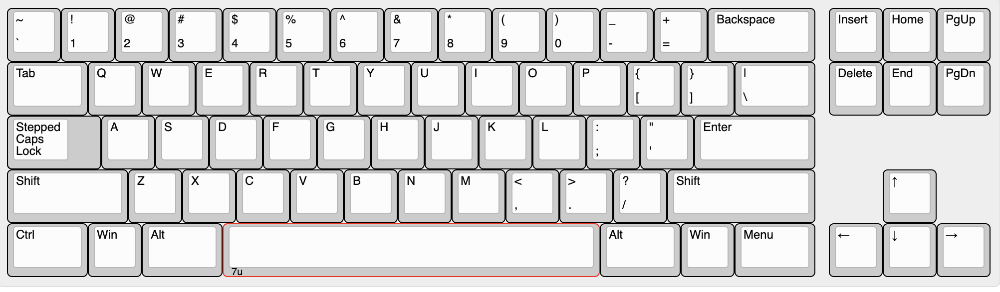

# Crin keyboard PCB
-----------

Open sourced replacement PCB for [crin keyboard](https://cannonkeys.com/products/gb-crin-keyboard)

## Fabrication
* verified production files can be found [here](./pcb_production)

## Plate
Plate files can be found here:
https://github.com/cBachoo/bachooKeyboardFiles/tree/master/Crin/CrinPlateFiles

## Misc
#### layout

#### PCB renders

#### Interactive BoM
download this [html](<./documentation/crin custom layout-ibom.html>) and run locally

#### Schematic
[pdf](<./documentation/crin custom layout-schematic.pdf>)

#### Flash
Flash with QMK Toolbox, with these settings

